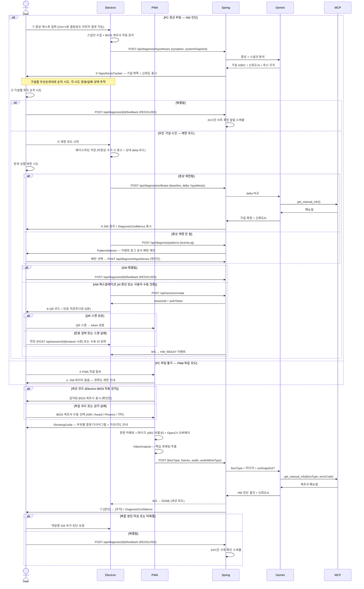
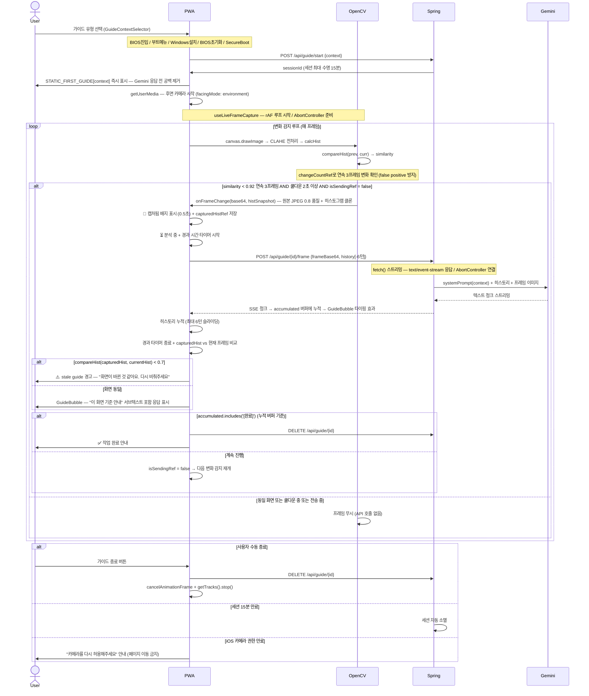

# 시스템 워크플로우 — 시퀀스 다이어그램

> 핵심 원칙 요약: `.claude/rules/workflow.md`

---

## 메인 진단 흐름

```mermaid
sequenceDiagram
    actor User
    participant Electron
    participant PWA
    participant Spring
    participant Gemini
    participant MCP

    alt PC 정상 부팅 — SW 진단
        User->>Electron: ① 증상 텍스트 입력 (Ctrl+V로 클립보드 이미지 첨부 가능)
        Electron->>Electron: 스냅샷 수집 + BIOS 제조사 자동 감지
        Electron->>Spring: POST /api/diagnosis/hypotheses {symptom, systemSnapshot}
        Spring->>Gemini: 증상 + 스냅샷 분석
        Gemini->>Spring: 가설 A/B/C + 신뢰도% + 즉시 조치
        Spring->>User: ② HypothesisTracker — 가설 목록 + 신뢰도 표시
        Note over User,Electron: 가설을 우선순위대로 순차 시도. 각 시도 완료/실패 상태 추적

        User->>User: ③ 가설별 조치 순차 시도

        alt 해결됨
            User->>Spring: POST /api/diagnosis/{id}/feedback (RESOLVED)
            Spring->>Spring: 24시간 사후 확인 알림 스케줄
        else 모든 가설 소진 — 재현 모드
            User->>Electron: ④ 재현 모드 시작
            Electron->>Electron: 베이스라인 저장 (비정상 수치 시 경고 + 상대 delta 모드)
            User->>User: 문제 상황 재현 시도

            alt 증상 재현됨
                Electron->>Spring: POST /api/diagnosis/software {baseline, delta, hypothesis}
                Spring->>Gemini: delta 비교
                Gemini->>MCP: get_manual_info()
                MCP->>Gemini: 매뉴얼
                Gemini->>Spring: 가설 확정 + 신뢰도%
                Spring->>User: ⑤ SW 결과 + DiagnosisConfidence 표시
            else 증상 재현 안 됨
                Electron->>Spring: POST /api/diagnosis/patterns {eventLog}
                Spring->>User: PatternSelector — 이벤트 로그 유사 패턴 제안
                User->>Spring: 패턴 선택 → POST /api/diagnosis/hypotheses (재진단)
            end

            alt SW 해결됨
                User->>Spring: POST /api/diagnosis/{id}/feedback (RESOLVED)
            else HW 에스컬레이션 (AI 판단 또는 사용자 수동 전환)
                Electron->>Spring: POST /api/session/create
                Spring->>Electron: sessionId + authToken
                Electron->>User: ⑥ QR 코드 + 만료 카운트다운 (5분)

                alt QR 스캔 성공
                    User->>PWA: QR 스캔 → token 검증
                else 만료 임박 또는 스캔 실패
                    User->>Electron: 연장 (POST /api/session/{id}/extend +5분) 또는 수동 ID 입력
                end
                Spring->>Electron: WS → HW_READY 이벤트
            end
        end

    else PC 부팅 불가 — PWA 독립 모드
        User->>PWA: ① PWA 직접 접속
        PWA->>User: ⚠️ SW 데이터 없음 — 정확도 제한 안내
    end

    %% ── HW 진단 공통 흐름 ──
    alt 세션 모드 (Electron BIOS 자동 감지)
        PWA->>User: 감지된 BIOS 제조사 표시 (확인만)
    else 독립 모드 또는 감지 실패
        User->>PWA: BIOS 제조사 수동 선택 (AMI / Award / Phoenix / 기타)
    end

    PWA->>User: ShootingGuide — 부위별 촬영 다이어그램 + 거리/각도 안내
    PWA->>PWA: 후면 카메라 + 마이크 (AEC 비활성) + OpenCV 오버레이
    PWA->>PWA: VideoAnalysis — 핵심 프레임 추출
    PWA->>Spring: POST {biosType, frames, audio, audioMimeType}
    Spring->>Gemini: biosType + 미디어 + swSnapshot?
    Gemini->>MCP: get_manual_info(biosType, errorCode)
    MCP->>Gemini: 제조사 매뉴얼
    Gemini->>Spring: HW 진단 결과 + 신뢰도%
    Spring-->>Electron: WS → DONE (세션 모드)
    Spring->>User: ⑦ [원인] → [조치] + DiagnosisConfidence

    alt 복합 원인 의심 또는 미해결
        User->>Electron: 역방향 SW 추가 진단 요청
    else 해결됨
        User->>Spring: POST /api/diagnosis/{id}/feedback (RESOLVED)
        Spring->>Spring: 24시간 사후 확인 스케줄
    end
```

---

## Phase 7-B — 라이브 카메라 가이드 모드

```mermaid
sequenceDiagram
    actor User
    participant PWA
    participant OpenCV
    participant Spring
    participant Gemini

    User->>PWA: 가이드 유형 선택 (GuideContextSelector)
    Note over PWA: BIOS진입 / 부트메뉴 / Windows설치 / BIOS초기화 / SecureBoot
    PWA->>Spring: POST /api/guide/start {context}
    Spring->>PWA: sessionId (세션 최대 수명 15분)
    PWA->>User: STATIC_FIRST_GUIDE[context] 즉시 표시 — Gemini 응답 전 공백 제거

    PWA->>PWA: getUserMedia — 후면 카메라 시작 (facingMode: environment)
    Note over PWA,OpenCV: useLiveFrameCapture — rAF 루프 시작 / AbortController 준비

    loop 변화 감지 루프 (매 프레임)
        PWA->>OpenCV: canvas.drawImage → CLAHE 전처리 → calcHist
        OpenCV->>OpenCV: compareHist(prev, curr) → similarity
        Note over OpenCV: changeCountRef로 연속 3프레임 변화 확인 (false positive 방지)

        alt similarity < 0.92 연속 3프레임 AND 쿨다운 2초 이상 AND isSendingRef = false
            OpenCV->>PWA: onFrameChange(base64, histSnapshot) — 원본 JPEG 0.8 품질 + 히스토그램 클론
            PWA->>PWA: 📸 캡처됨 배지 표시 (0.5초) + capturedHistRef 저장
            PWA->>PWA: ⏳ 분석 중 + 경과 시간 타이머 시작
            PWA->>Spring: POST /api/guide/{id}/frame {frameBase64, history[-6턴]}
            Note over Spring: fetch() 스트리밍 — text/event-stream 응답 / AbortController 연결
            Spring->>Gemini: systemPrompt(context) + 히스토리 + 프레임 이미지
            Gemini-->>Spring: 텍스트 청크 스트리밍
            Spring-->>PWA: SSE 청크 → accumulated 버퍼에 누적 → GuideBubble 타이핑 효과
            PWA->>PWA: 히스토리 누적 (최대 6턴 슬라이딩)
            PWA->>PWA: 경과 타이머 종료 + capturedHist vs 현재 프레임 비교

            alt compareHist(capturedHist, currentHist) < 0.7
                PWA->>User: ⚠️ stale guide 경고 — "화면이 바뀐 것 같아요. 다시 비춰주세요"
            else 화면 동일
                PWA->>User: GuideBubble — "이 화면 기준 안내" 서브텍스트 포함 응답 표시
            end

            alt accumulated.includes('[완료]') (누적 버퍼 기준)
                PWA->>Spring: DELETE /api/guide/{id}
                PWA->>User: ✅ 작업 완료 안내
            else 계속 진행
                PWA->>PWA: isSendingRef = false → 다음 변화 감지 재개
            end
        else 동일 화면 또는 쿨다운 중 또는 전송 중
            OpenCV->>OpenCV: 프레임 무시 (API 호출 없음)
        end
    end

    alt 사용자 수동 종료
        User->>PWA: 가이드 종료 버튼
        PWA->>Spring: DELETE /api/guide/{id}
        PWA->>PWA: cancelAnimationFrame + getTracks().stop()
    else 세션 15분 만료
        Spring->>Spring: 세션 자동 소멸
    else iOS 카메라 권한 만료
        PWA->>User: "카메라를 다시 허용해주세요" 안내 (페이지 이동 금지)
    end
```
