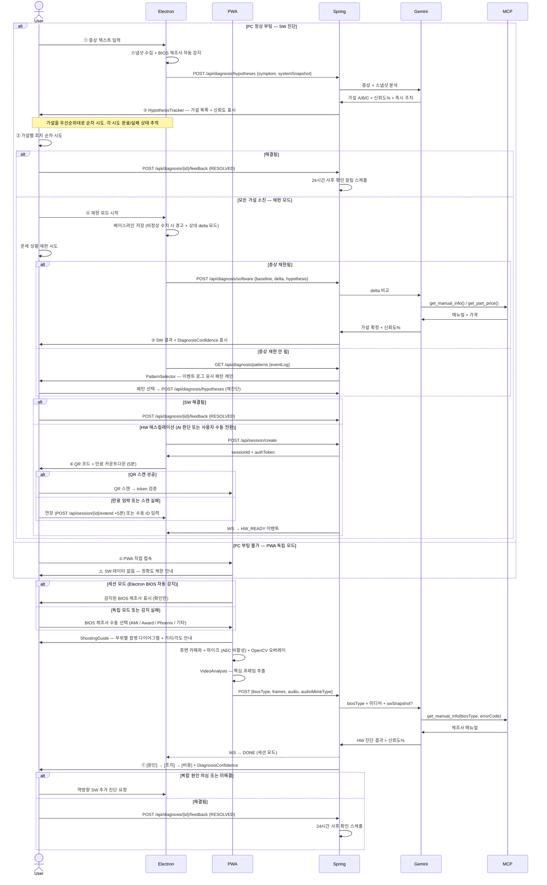

# 시스템 워크플로우

> PC 상태에 따라 두 가지 진입점. 가설 순차 추적 → 재현(실패 시 패턴 선택) → HW 에스컬레이션(QR 연장/수동 입력) → 복합 원인 계속 진단 → 사후 확인.

```mermaid
sequenceDiagram
    actor User
    participant Electron
    participant PWA
    participant Spring
    participant Gemini
    participant MCP

    alt PC 정상 부팅 — SW 진단
        User->>Electron: ① 증상 텍스트 입력
        Electron->>Electron: 스냅샷 수집 + BIOS 제조사 자동 감지
        Electron->>Spring: POST /api/diagnosis/hypotheses {symptom, systemSnapshot}
        Spring->>Gemini: 증상 + 스냅샷 분석
        Gemini->>Spring: 가설 A/B/C + 신뢰도% + 즉시 조치
        Spring->>User: ② HypothesisTracker — 가설 목록 + 신뢰도 표시
        Note over User,Electron: 가설을 우선순위대로 순차 시도. 각 시도 완료/실패 상태 추적

        User->>User: ③ 가설별 조치 순차 시도

        alt 해결됨
            User->>Spring: POST /api/diagnosis/{id}/feedback (RESOLVED)
            Spring->>Spring: 24시간 사후 확인 알림 스케줄
        else 모든 가설 소진 — 재현 모드
            User->>Electron: ④ 재현 모드 시작
            Electron->>Electron: 베이스라인 저장 (비정상 수치 시 경고 + 상대 delta 모드)
            User->>User: 문제 상황 재현 시도

            alt 증상 재현됨
                Electron->>Spring: POST /api/diagnosis/software {baseline, delta, hypothesis}
                Spring->>Gemini: delta 비교
                Gemini->>MCP: get_manual_info() / get_part_price()
                MCP->>Gemini: 매뉴얼 + 가격
                Gemini->>Spring: 가설 확정 + 신뢰도%
                Spring->>User: ⑤ SW 결과 + DiagnosisConfidence 표시
            else 증상 재현 안 됨
                Electron->>Spring: GET /api/diagnosis/patterns {eventLog}
                Spring->>User: PatternSelector — 이벤트 로그 유사 패턴 제안
                User->>Spring: 패턴 선택 → POST /api/diagnosis/hypotheses (재진단)
            end

            alt SW 해결됨
                User->>Spring: POST /api/diagnosis/{id}/feedback (RESOLVED)
            else HW 에스컬레이션 (AI 판단 또는 사용자 수동 전환)
                Electron->>Spring: POST /api/session/create
                Spring->>Electron: sessionId + authToken
                Electron->>User: ⑥ QR 코드 + 만료 카운트다운 (5분)

                alt QR 스캔 성공
                    User->>PWA: QR 스캔 → token 검증
                else 만료 임박 또는 스캔 실패
                    User->>Electron: 연장 (POST /api/session/{id}/extend +5분) 또는 수동 ID 입력
                end
                Spring->>Electron: WS → HW_READY 이벤트
            end
        end

    else PC 부팅 불가 — PWA 독립 모드
        User->>PWA: ① PWA 직접 접속
        PWA->>User: ⚠️ SW 데이터 없음 — 정확도 제한 안내
    end

    %% ── HW 진단 공통 흐름 ──
    alt 세션 모드 (Electron BIOS 자동 감지)
        PWA->>User: 감지된 BIOS 제조사 표시 (확인만)
    else 독립 모드 또는 감지 실패
        User->>PWA: BIOS 제조사 수동 선택 (AMI / Award / Phoenix / 기타)
    end

    PWA->>User: ShootingGuide — 부위별 촬영 다이어그램 + 거리/각도 안내
    PWA->>PWA: 후면 카메라 + 마이크 (AEC 비활성) + OpenCV 오버레이
    PWA->>PWA: VideoAnalysis — 핵심 프레임 추출
    PWA->>Spring: POST {biosType, frames, audio, audioMimeType}
    Spring->>Gemini: biosType + 미디어 + swSnapshot?
    Gemini->>MCP: get_manual_info(biosType, errorCode)
    MCP->>Gemini: 제조사 매뉴얼
    Gemini->>Spring: HW 진단 결과 + 신뢰도%
    Spring-->>Electron: WS → DONE (세션 모드)
    Spring->>User: ⑦ [원인] → [조치] → [비용] + DiagnosisConfidence

    alt 복합 원인 의심 또는 미해결
        User->>Electron: 역방향 SW 추가 진단 요청
    else 해결됨
        User->>Spring: POST /api/diagnosis/{id}/feedback (RESOLVED)
        Spring->>Spring: 24시간 사후 확인 스케줄
    end
```
