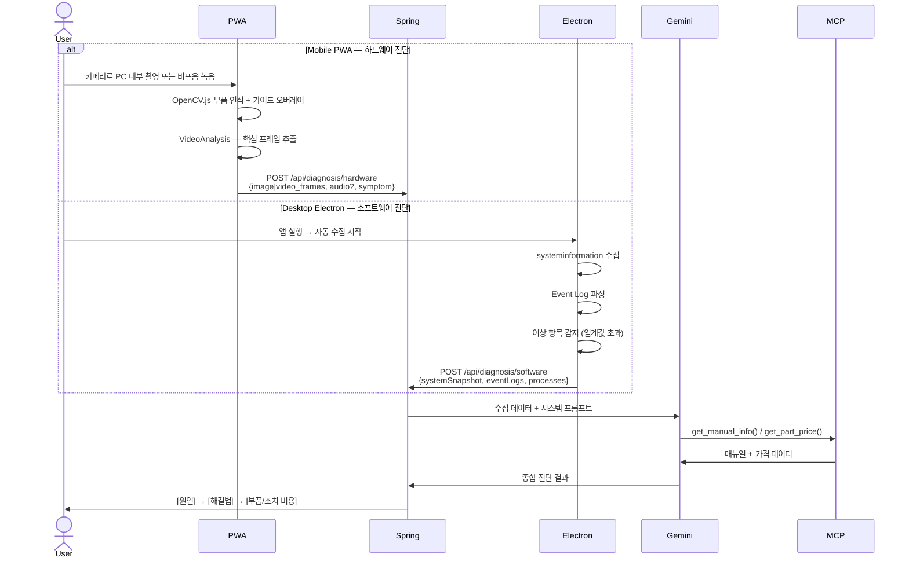

# 옆집 컴공생 (NextDoor CS)

> "수리기사 부르기 전, 옆집 컴공생에게 먼저 물어보세요!"
> **Mobile PWA** = 하드웨어 시각/청각 진단 | **Desktop Electron** = 소프트웨어 시스템 진단

@.claude/rules/glossary.md
@.claude/rules/coding-conventions.md
@.claude/rules/implementation-checklist.md

---

## 진단 모드 분리 (핵심 설계 원칙)

| 구분 | Mobile (PWA) | Desktop (Electron) |
|---|---|---|
| **배포** | 브라우저 PWA (설치 불필요) | Electron 앱 (.exe / .dmg) |
| **진단 대상** | **하드웨어** 물리적 문제 | **소프트웨어** 시스템 문제 |
| **입력 수단** | 카메라(이미지/영상) + 마이크(비프음) | OS 시스템 데이터 자동 수집 |
| **진단 예시** | 부팅 오류 LED, 비프음 패턴, 부품 손상 | CPU 과부하, 메모리 누수, 프로세스 충돌 |
| **핵심 기술** | OpenCV.js + MediaRecorder + Gemini Vision | systeminformation + Event Log + Gemini |

---

## Mobile PWA — 하드웨어 진단 범위

```
카메라로 촬영 →  메인보드 불량 커패시터, RAM 슬롯 상태, GPU 팬 이상
                부팅 오류 POST 코드 디스플레이 촬영
                LED 상태 패턴 인식 (전원/에러 표시등)

마이크로 녹음 →  비프음 패턴 분석 (1롱2숏 = RAM 오류 등)
                팬 소음 이상 감지 (베어링 마모, 먼지 과적)

영상 분석   →   PC 내부 촬영 영상에서 핵심 프레임 추출 + 연속 분석
```

## Desktop Electron — 소프트웨어 진단 범위

```
실시간 모니터링 →  CPU/GPU 사용률, 온도, 클럭
                   메모리 사용량, 누수 패턴
                   디스크 I/O, S.M.A.R.T 상태

프로세스 분석  →   자원 독점 프로세스 탐지
                   좀비 프로세스, 비정상 메모리 점유

이벤트 로그   →   Windows Event Log 에러/경고 수집
                  드라이버 충돌, 블루스크린(BSOD) 이력
                  시스템 크래시 덤프 분석

네트워크 진단 →   연결 상태, DNS, 포트 점유
```

---

## Tech Stack

| Layer | Mobile PWA | Desktop Electron |
|---|---|---|
| Shell | React PWA (manifest + SW) | Electron 28+ (Node.js 20) |
| UI | React (공유 컴포넌트) | React (공유 컴포넌트) |
| 하드웨어 입력 | `getUserMedia` (카메라/마이크) | — |
| 시스템 수집 | — | `systeminformation` + `child_process` |
| 이미지 처리 | OpenCV.js (WASM) | — |
| AI 분석 | Gemini 3.1 Pro (`gemini-3.1-pro-preview`) | Gemini 3.1 Pro |
| 백엔드 | Spring Boot 3.x + Spring AI (공유) | Spring Boot 3.x + Spring AI (공유) |
| DB | PostgreSQL + JPA (공유) | PostgreSQL + JPA (공유) |
| 실시간 | — | — |
| 세션 연결 | WebSocket STOMP (공유) | WebSocket STOMP (공유) |

---

## Project Structure

```
nextdoor-cs/
├── electron/                          # Electron 메인 프로세스
│   ├── main.js                        # BrowserWindow 생성
│   ├── preload.js                     # IPC 브리지 (contextBridge)
│   └── modules/
│       ├── systemMonitor.js           # CPU/GPU/메모리/온도 수집
│       ├── processAnalyzer.js         # 고부하 프로세스 분석
│       ├── eventLogReader.js          # Windows Event Log 파싱
│       └── diskHealth.js              # S.M.A.R.T 디스크 상태
│
├── pwa/                               # PWA 전용 진입점
│   └── public/
│       ├── manifest.json              # PWA 설치 설정
│       └── sw.js                      # Service Worker (오프라인 캐시)
│
├── src/                               # 공유 React 코드
│   ├── components/
│   │   ├── desktop/                   # Electron 전용
│   │   │   ├── SystemDashboard.jsx    # CPU/GPU/메모리 실시간 게이지
│   │   │   ├── ProcessList.jsx        # 고부하 프로세스 목록
│   │   │   ├── EventLogViewer.jsx     # 이벤트 로그 에러 목록
│   │   │   └── DiskHealthCard.jsx     # S.M.A.R.T 상태
│   │   ├── mobile/                    # PWA 전용
│   │   │   ├── CameraView.jsx         # 후면 카메라 + OpenCV 오버레이
│   │   │   ├── VideoAnalysis.jsx      # 영상 → 핵심 프레임 추출
│   │   │   └── AudioCapture.jsx       # 비프음/팬소음 녹음
│   │   └── shared/
│   │       └── DiagnosisResult.jsx    # 공통 AI 진단 결과 카드
│   ├── hooks/
│   │   ├── useRuntimeMode.js          # 'electron' | 'pwa' 감지
│   │   ├── useSystemInfo.js           # Electron IPC 시스템 데이터
│   │   ├── useOpenCV.js               # OpenCV.js 초기화 (PWA)
│   │   └── useFpsMonitor.js           # rAF FPS 측정 (공통)
│   └── api/
│       └── diagnosisApi.js
│
├── backend/
│   └── src/main/java/com/nextdoorcs/
│       ├── controller/                # DiagnosisController.java
│       ├── service/                   # DiagnosisService.java, GeminiService.java
│       ├── agent/                     # RepairAgent.java
│       ├── mcp/                       # ManualToolProvider.java, PriceToolProvider.java
│       └── entity/                    # DiagnosisHistory.java, SolutionKnowledge.java
└── docker-compose.yml
```

---

## System Workflow



---

## Phase Roadmap

| Phase | 환경 | 목표 | 핵심 파일 |
|---|---|---|---|
| **1** | 공통 | 백엔드 Gemini API 기반 구축 | `GeminiService.java`, `DiagnosisController.java` |
| **2** | Electron | 앱 셋업 + IPC 브리지 | `main.js`, `preload.js`, `useRuntimeMode.js` |
| **3** | Electron | 시스템 모니터 (CPU/GPU/메모리/온도) | `systemMonitor.js`, `SystemDashboard.jsx` |
| **4** | Electron | 프로세스 + 이벤트 로그 분석 | `processAnalyzer.js`, `eventLogReader.js` |
| **5** | Electron | 2-트랙 SW 진단 (증상→가설→재현모니터링) | `SymptomInput.jsx`, `HypothesisList.jsx`, `ReproductionMode.jsx`, `useReproductionMonitor.js` |
| **6** | PWA | PWA 셋업 + 카메라 기본 | `manifest.json`, `sw.js`, `CameraView.jsx` |
| **7** | PWA | OpenCV 부품 오버레이 + 영상 분석 | `useOpenCV.js`, `VideoAnalysis.jsx` |
| **8** | PWA | 비프음/팬소음 오디오 진단 | `AudioCapture.jsx`, 멀티모달 확장 |
| **9** | 공통 | MCP 매뉴얼/가격 툴 연동 | `ManualToolProvider.java`, `RepairAgent.java` |
| **10** | 공통 | DB 진단 이력 + 지식베이스 | `DiagnosisHistory.java`, `SolutionKnowledge.java` |
| **11** | 공통 | 크로스 플랫폼 세션 연결 | `SessionController.java`, `QRDisplay.jsx`, `QRScanner.jsx` |

---

## API Endpoints

| Method | Endpoint | 클라이언트 | 설명 |
|---|---|---|---|
| POST | `/api/diagnosis/hardware` | Mobile PWA | 이미지/영상/비프음 → 하드웨어 진단 |
| POST | `/api/diagnosis/hypotheses` | Desktop Electron | 증상 텍스트 + 스냅샷 → 가설 A/B/C 목록 |
| POST | `/api/diagnosis/software` | Desktop Electron | 베이스라인 + 재현 델타 → 가설 확정 + 해결책 |
| GET | `/api/diagnosis/history/{sessionId}` | 공통 | 진단 이력 조회 |
| GET | `/api/manual?model=ASUS-B760&code=3long1short` | 공통 | 매뉴얼 조회 |
| POST | `/api/session` | Electron | 세션 생성 + QR용 sessionId 반환 |
| GET | `/api/session/{id}` | 공통 | 세션 상태 조회 |
| POST | `/api/session/{id}/software` | Electron | SW 스냅샷 제출 |
| POST | `/api/session/{id}/hardware` | PWA | HW 영상/이미지 제출 |
| WS | `/ws` → `/topic/session/{id}` | 공통 | 진단 결과 실시간 브로드캐스트 |

---

## Build & Run

```bash
# 백엔드
cd backend && ./mvnw spring-boot:run
./mvnw test

# Electron (개발)
npm install && npm run electron:dev

# Electron 배포
npm run electron:build    # → dist/*.exe (Win) / *.dmg (Mac)

# PWA (개발)
npm run pwa:dev           # http://localhost:3000

# PWA 배포 (HTTPS 필수)
npm run pwa:build
```

# Render 배포
git push origin main  # Render 자동 배포 (GitHub 연동)
# 환경변수 Render 대시보드에서 설정:
# GEMINI_API_KEY, SPRING_DATASOURCE_URL (Supabase), ALLOWED_ORIGINS

> **Phase별 상세 검증 명령어**: `/implement-phase <번호>` 실행 시 자동 안내

---

## Agent Persona (System Prompt)

```
당신은 '옆집 컴공생' AI입니다.
- 말투: 친근한 공대생 형/누나처럼 ("어, 이거 내가 봐줄게")
- 전문 용어는 반드시 괄호로 설명 추가
- 답변 형식: "여기[부품/프로세스]에 문제가 있는 것 같아요. 해결방법은 ~~ 입니다."
- 원인 + 해결방법만 제공. 가격/비용 정보는 포함하지 않음
- 수리 불가 판단 시: "이건 수리기사 부르는 게 나을 것 같아" 솔직하게 안내
```

---

## Critical Notes

- **AI 모델**: `gemini-3.1-pro-preview` (2026.02 출시) — Phase 1 전 API Key로 모델 목록 접근 확인 필수. 없으면 `gemini-2.0-flash`로 대체
- **Electron 보안**: `contextIsolation: true`, `nodeIntegration: false` + preload IPC 패턴 필수
- **PWA HTTPS**: `getUserMedia` + Service Worker는 HTTPS 필수 (localhost 제외)
- **Event Log 권한**: Windows Event Log 읽기는 관리자 권한 불필요. 단, Security 로그는 필요
- **온도 데이터**: `systeminformation` CPU 온도는 WMI 의존 → AMD/일부 OEM 환경에서 `null` 반환. Gemini 전송 시 null 필드 제외 처리 필수
- **영상 분석**: 영상 전체를 Gemini에 보내지 않고 1~2초 간격 핵심 프레임만 추출해서 전송
- **OpenCV.js**: PWA 전용. WASM ~8MB → Service Worker 사전 캐시 필수. Mat 객체는 `try/finally`로 `.delete()` 보장
- **CORS**: Spring Boot에서 Electron(`app://`) + PWA(`localhost:3000`) 모두 허용
- **JSONB 결정**: `DiagnosisHistory.aiDiagnosis` 컴럼 타입을 Phase 1 설계 시점에 TEXT vs JSONB 확정. 나중 변경 시 DB 마이그레이션 필요 (세부 사항: `data-model.md` 참고)
- **GeminiService.extractText()**: 현재 null 방어 없음 — API 오류/모델 미존재 시 NPE 발생. Phase 1 구현 시 null 체크 추가 필수
- **MCP Tool Calling**: `get_manual_info()` 등록 후 AI가 실제 툴을 호출하지 않는 silent failure 발생 가능. System Prompt에 툴 호출 조건 명시 필요
- **IPC 리스너**: React Strict Mode에서 useEffect 2회 실행 → `ipcRenderer.on()` 이중 등록. `removeAllListeners()` 선행 호출 필수

